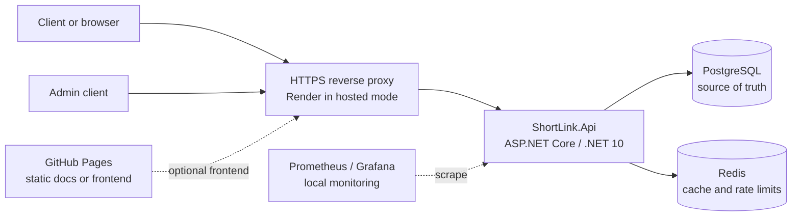
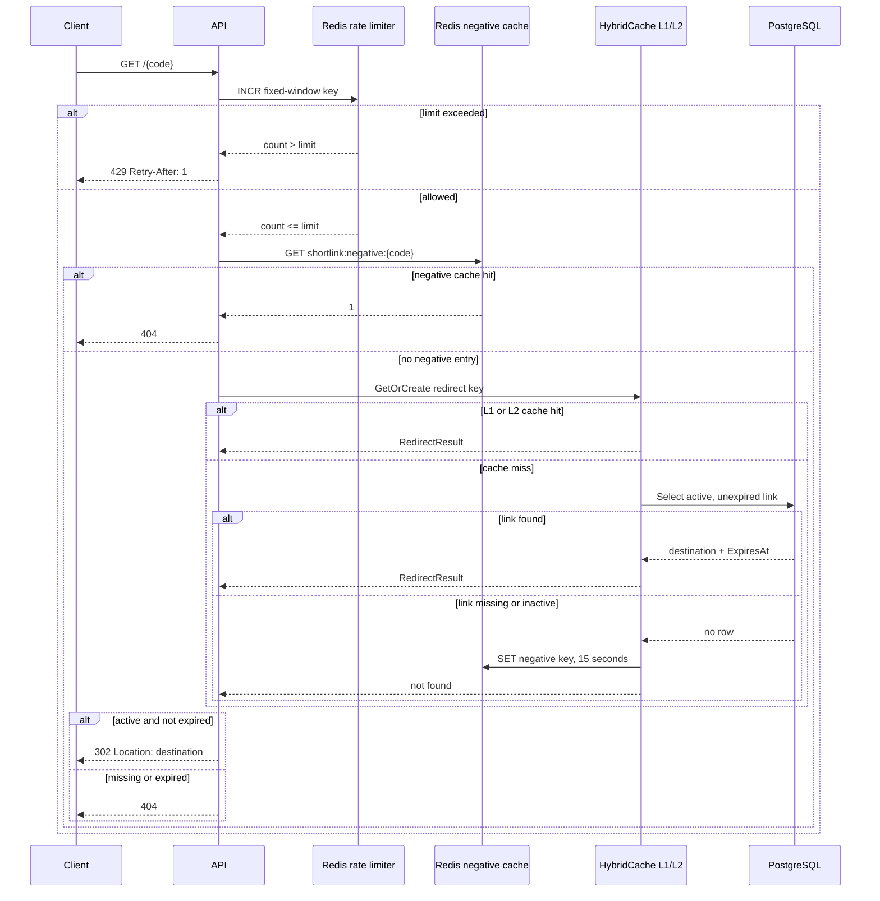
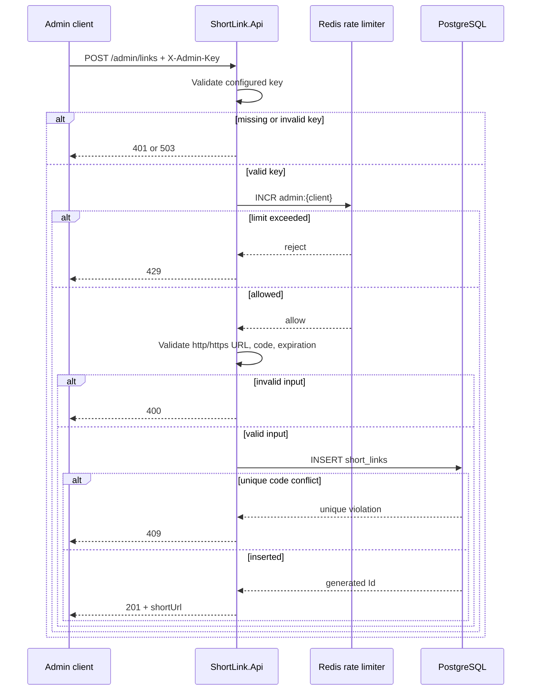
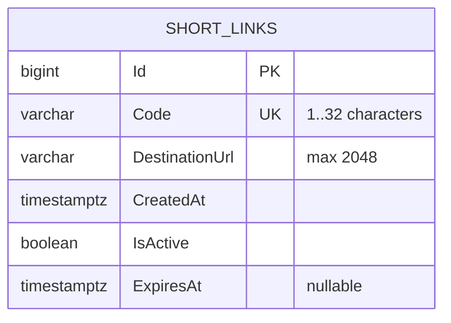
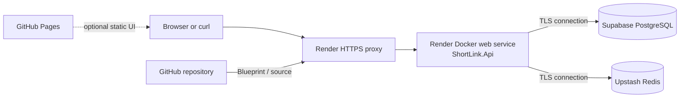

# ShortLink Architecture

This document explains how ShortLink works, why the components exist, and where the current design makes deliberate tradeoffs. The diagrams use Mermaid and render in GitHub, GitHub Pages, and most modern Markdown viewers.

## 1. System Context

ShortLink has a stateful API. GitHub Pages can host documentation or a future static frontend, but it cannot run the API, PostgreSQL, Redis, migrations, or rate limiter.



### Component responsibilities

| Component        | Responsibility                                                                              | State                                   | Failure impact                                               |
| ---------------- | ------------------------------------------------------------------------------------------- | --------------------------------------- | ------------------------------------------------------------ |
| ASP.NET Core API | Validates input, authenticates admin requests, resolves redirects, exposes health endpoints | No durable state                        | Service unavailable while down                               |
| PostgreSQL       | Stores links and enforces unique codes                                                      | Durable                                 | Creation fails; uncached redirects fail                      |
| Redis            | Distributed rate limits, HybridCache L2, negative lookup cache                              | Rebuildable cache plus rate-limit state | Behavior depends on `RateLimiting:FailOpen`; readiness fails |
| HybridCache L1   | Per-process hot redirect cache                                                              | Rebuildable                             | More database traffic after eviction                         |
| Reverse proxy    | TLS termination, routing, client IP forwarding                                              | No application state                    | Requests cannot reach the API                                |
| GitHub Pages     | Static documentation or frontend only                                                       | Static files                            | Does not affect API runtime                                  |

## 2. Runtime Request Pipeline

Every request enters the ASP.NET Core process. Forwarded headers are processed first, then exception handling, health endpoints, metrics, and application routes are mapped.

```mermaid
flowchart TD
    request[HTTP request] --> forwarded[Forwarded headers middleware]
    forwarded --> errors[Exception handler]
    errors --> route{Route}
    route -->|GET /health/live| live[Liveness check\nno dependencies]
    route -->|GET /health/ready| ready[Readiness checks\nPostgreSQL + Redis]
    route -->|GET /metrics| metrics[Prometheus metrics\nwhen enabled]
    route -->|POST /admin/links| admin[Admin API key\nthen admin rate limit]
    route -->|GET /{code}| redirect[Redirect rate limit]
    route -->|other| notFound[404]
```

### Why the ordering matters

- Forwarded headers must run before the client partition key is calculated, otherwise all requests behind a proxy could share one rate-limit identity.
- The liveness endpoint deliberately does not check PostgreSQL or Redis. Orchestrators should not restart a healthy process merely because a dependency is temporarily unavailable.
- The readiness endpoint checks dependencies and is the correct signal for traffic routing.
- Metrics are enabled locally and disabled in the public Render blueprint because the metrics endpoint has no authentication layer.

## 3. Redirect Resolution

The redirect path is optimized for repeated reads. Redis negative caching avoids repeatedly querying PostgreSQL for unknown codes. Successful results use HybridCache with a process-local L1 and Redis-backed L2.



### Cache invariants

1. PostgreSQL is the source of truth.
2. A cached redirect includes `ExpiresAt`, so an expired link is rejected even if its 24-hour cache entry still exists.
3. A missing result is evicted from HybridCache immediately. The separate Redis negative cache controls the 15-second negative lookup window.
4. Redis and HybridCache failures are logged; a cache failure should normally fall back to PostgreSQL rather than produce a false redirect.
5. There is currently no update or delete endpoint, so explicit positive-cache invalidation is not needed yet. Any future mutation endpoint must remove the corresponding redirect cache key.

## 4. Link Creation

Link creation is intentionally a small admin API. It validates the destination and optional expiration before attempting the insert.



### Input rules

- Destination must be an absolute `http` or `https` URL and no longer than 2048 characters.
- A supplied code must be 1 to 32 characters. If omitted, a cryptographically seeded code is generated.
- `expiresAt` is optional, but if present it must be in the future.
- PostgreSQL's unique index is authoritative for concurrent code creation. The pre-insert existence query was intentionally removed because it cannot prevent a race by itself.

## 5. Rate Limiting

The rate limiter uses a Redis Lua script so increment and first-write expiration happen atomically.

```mermaid
flowchart TD
    request[Request] --> identity[Partition key]
    identity --> key[shortlink:ratelimit:{bucket}:{partition}]
    key --> lua[Redis Lua script]
    lua --> increment[INCR key]
    increment --> first{count == 1?}
    first -->|yes| expiry[EXPIRE key window]
    first -->|no| compare[Compare count to limit]
    expiry --> compare
    compare --> allowed{count <= limit?}
    allowed -->|yes| continue[Continue request]
    allowed -->|no| reject[429 + Retry-After]
    lua -. Redis error .-> fallback{FailOpen?}
    fallback -->|yes| continue
    fallback -->|no| reject
```

The algorithm is a fixed-window counter. It is simple and inexpensive, but clients can make a burst at a window boundary. An API gateway or edge limiter should be added for high-risk internet-facing traffic.

The redirect partition uses the remote IP after trusted forwarded-header processing. The admin partition is prefixed with `admin:` so admin traffic has an independent namespace.

## 6. Persistence Model



Indexes:

- Unique `Code` index: prevents duplicate short codes.
- `(Code, IsActive)` index: supports the redirect lookup predicate.

The current schema has one table by design. It avoids joins and keeps the redirect read path small. Audit history, ownership, click analytics, and soft-delete metadata are not modeled yet.

## 7. Startup, Health, and Migrations

```mermaid
flowchart TD
    start[Process starts] --> config[Load configuration]
    config --> deps[Register PostgreSQL, Redis, cache, health checks, metrics]
    deps --> build[Build application]
    build --> proxy[Configure forwarded headers]
    proxy --> migrate{Development or\nDatabase:ApplyMigrations=true?}
    migrate -->|yes| apply[Apply EF migrations]
    migrate -->|no| routes[Map routes]
    apply --> routes
    routes --> live[/health/live\nprocess only]
    routes --> ready[/health/ready\nPostgreSQL + Redis]
```

Development Compose enables migrations automatically. The Render blueprint also enables startup migrations because it uses one free instance. For multiple production instances, prefer a separate migration job so two application instances do not race during deployment.

## 8. Deployment Topology



### Local versus hosted configuration

| Concern           | Local Compose                      | Render free deployment                |
| ----------------- | ---------------------------------- | ------------------------------------- |
| API environment   | `Development`                      | `Production`                          |
| Migrations        | Startup enabled                    | Startup enabled for one free instance |
| PostgreSQL        | Compose container                  | Supabase managed PostgreSQL           |
| Redis             | Compose container                  | Upstash TLS Redis                     |
| Metrics           | Enabled for Prometheus             | Disabled publicly                     |
| Forwarded headers | Known proxies list, normally empty | One trusted Render proxy hop          |
| Secrets           | `.env`, ignored by Git             | Render secret environment variables   |
| Public URL        | `http://localhost:8080`            | Render service URL                    |

## 9. Failure Behavior

| Failure                                 | Expected behavior                                                                                     | Reasoning                                                 |
| --------------------------------------- | ----------------------------------------------------------------------------------------------------- | --------------------------------------------------------- |
| PostgreSQL unavailable                  | Readiness fails; uncached resolution or creation fails                                                | PostgreSQL is the source of truth                         |
| Redis unavailable with `FailOpen=false` | Redirect and admin requests receive rate-limit rejection; cache reads log and continue where possible | Secure default avoids uncontrolled traffic                |
| Redis unavailable with `FailOpen=true`  | Rate limiter allows requests                                                                          | Availability-first option for trusted deployments         |
| Unknown code                            | Redis negative cache for 15 seconds, then 404                                                         | Limits repeated database misses                           |
| Expired code in cache                   | Cache entry is removed and 404 returned                                                               | Expiration is checked at read time                        |
| Invalid admin key                       | 401                                                                                                   | Prevents link creation                                    |
| Missing admin key configuration         | 503                                                                                                   | Avoids accidentally running an unprotected admin endpoint |
| Concurrent duplicate code               | 409                                                                                                   | Database unique constraint handles the race               |
| API process restart                     | L1 cache is lost; Redis L2 and PostgreSQL remain                                                      | Cache is rebuildable                                      |
| Render idle period                      | First request may have a cold-start delay                                                             | Accepted free-tier tradeoff                               |

## 10. Security Boundaries

```mermaid
flowchart TD
    internet[Public internet] --> tls[TLS at hosting proxy]
    tls --> api[API]
    api --> auth[Admin API key for POST /admin/links]
    api --> rl[Per-client Redis rate limit]
    api --> validation[HTTP(S) destination validation]
    api --> data[Private PostgreSQL and Redis]
    secrets[Render secret environment variables] --> api
    untrusted[Untrusted X-Forwarded-* headers] -. ignored unless trusted proxy .-> api
    metrics[/metrics] -. disabled in Render blueprint .-> api
```

Important boundaries:

- The admin key is a shared secret, not a user identity system. It is appropriate for a small private admin surface, not multi-user administration.
- Forwarded headers are accepted only from configured proxies, except the explicit one-hop Render mode. The API must not be exposed directly while `TrustAll` is enabled.
- Redirect destinations are not fetched by the API, so the service does not perform server-side URL fetching. The redirect itself is intentionally an open redirect service.
- PostgreSQL and Redis should remain private and use TLS in hosted deployments.

## 11. Design Tradeoffs

### ASP.NET Core minimal API

**Choice:** Minimal route handlers in `Program.cs`.

**Benefits:** Small deployment surface, low ceremony, direct request flow, easy containerization.

**Costs:** As the API grows, validation, authorization, and route definitions will become crowded. A larger product should split endpoints into route modules or controllers and introduce application services.

### PostgreSQL as source of truth

**Choice:** Store links in PostgreSQL instead of Redis or a static file.

**Benefits:** Durable storage, unique constraints, transactions, backups, and future query capability.

**Costs:** A database is required even for a small deployment. Redirect cache misses pay database latency.

### Redis plus HybridCache

**Choice:** Process-local L1 cache, Redis L2 cache, and a separate negative cache.

**Benefits:** Very fast hot redirects, shared cache across API instances, reduced database load, and controlled caching of missing codes.

**Costs:** More infrastructure, cache failure modes, and invalidation complexity. Cache values must carry expiration metadata to avoid serving expired links.

### Fixed-window Redis limiter

**Choice:** Atomic Lua counter with a one-second window.

**Benefits:** Easy to reason about, cheap, distributed, and compatible with multiple API instances.

**Costs:** Boundary bursts and dependence on Redis. A token bucket or gateway-level limiter is better for strict traffic shaping.

### Shared admin API key

**Choice:** One API key in the `X-Admin-Key` header.

**Benefits:** Minimal setup for a small personal service.

**Costs:** No user identity, roles, audit trail, or per-user revocation. Replace with an identity provider and authorization policy before offering administration to multiple users.

### Startup migrations

**Choice:** Automatic migrations for local Compose and the single free Render instance.

**Benefits:** Easy first deployment and fewer manual steps.

**Costs:** Multiple instances can race, and a schema migration can block application startup. Use a dedicated migration job for a larger production deployment.

### Free-tier hosting

**Choice:** Render plus Supabase plus Upstash.

**Benefits:** Low or zero initial cost, managed databases, HTTPS, and a Docker deployment that matches local development.

**Costs:** Cold starts, service quotas, possible resource limits, provider-specific networking, and no strong availability guarantee. Treat it as a demo or low-volume service until paid capacity and backups are configured.

## 12. Extension Points

The next natural changes would be:

1. Replace the shared admin key with OIDC authentication and authorization.
2. Add update/deactivate endpoints with cache invalidation.
3. Add integration tests using disposable PostgreSQL and Redis containers.
4. Add structured request IDs and trace correlation.
5. Add click analytics asynchronously rather than slowing redirects.
6. Move production migrations into a dedicated deployment job.
7. Add a static frontend on GitHub Pages that calls the hosted API.
